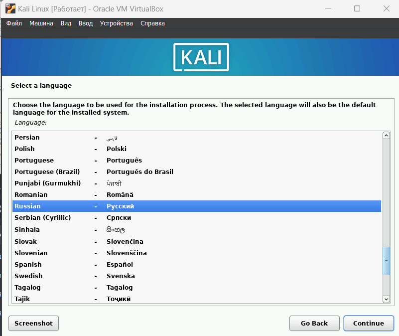
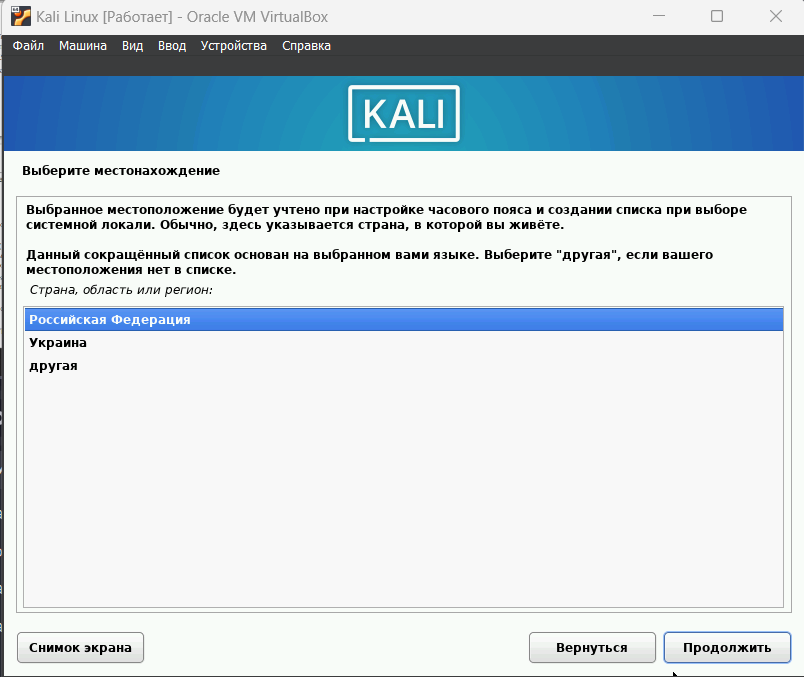
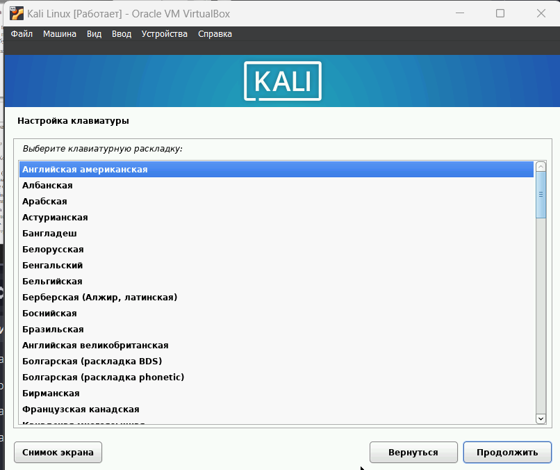
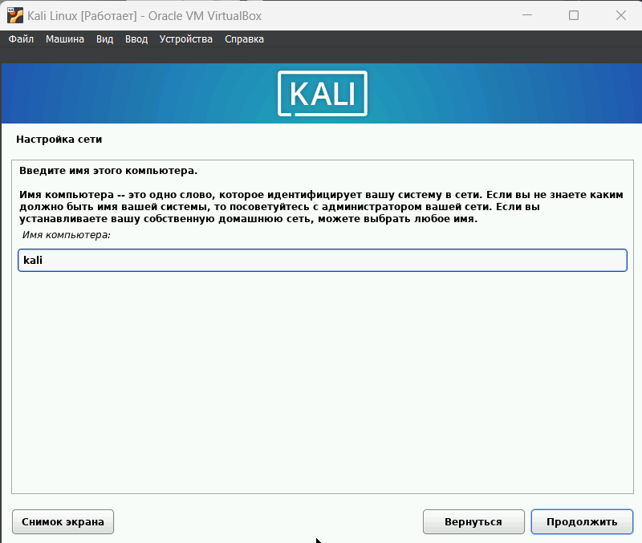
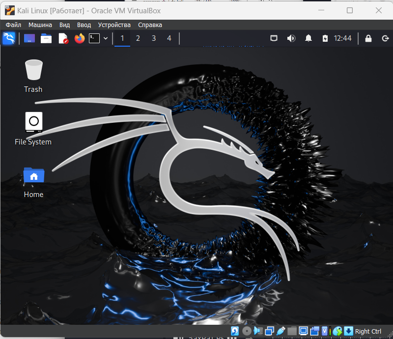

---
## Front matter
lang: ru-RU
title: Проект
subtitle: Этап 1
author:
  - Шатохина В.С.
institute:
  - Российский университет дружбы народов, Москва, Россия

## i18n babel
babel-lang: russian
babel-otherlangs: english

## Formatting pdf
toc: false
toc-title: Содержание
slide_level: 2
aspectratio: 169
section-titles: true
theme: metropolis
header-includes:
 - \metroset{progressbar=frametitle,sectionpage=progressbar,numbering=fraction}
 - '\makeatletter'
 - '\beamer@ignorenonframefalse'
 - '\makeatother'
---

# Информация

## Докладчик

:::::::::::::: {.columns align=center}
::: {.column width="70%"}

  * Шатохина Виктория Сергеевна
  * НФИбд-02-21
  * Российский университет дружбы народов
  * 1032217046
 

:::
::: {.column width="30%"}

:::
::::::::::::::

# Выполнение

## Цель работы
Знакомство с дистрибутивом Kali Linux.

## Выполнение лабораторной работы

**1.** Скачала сайт Kali Linux образ.

**2.** Настроила виртуальную машину. 

##

{ #fig:002 width=60% }

##

{ #fig:003 width=60% }

##

{ #fig:004 width=60% }

##

{ #fig:005 width=60% }

##

**3.** Задала учетные данные. 

{ #fig:006 width=60% }

##

**4.** Перезапустила и зашла под учеткой. 

{ #fig:007 width=60% }

# Вывод

Я познакомилась c дистрибутивом Kali Linux.
